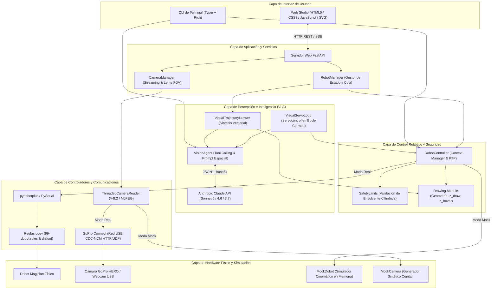
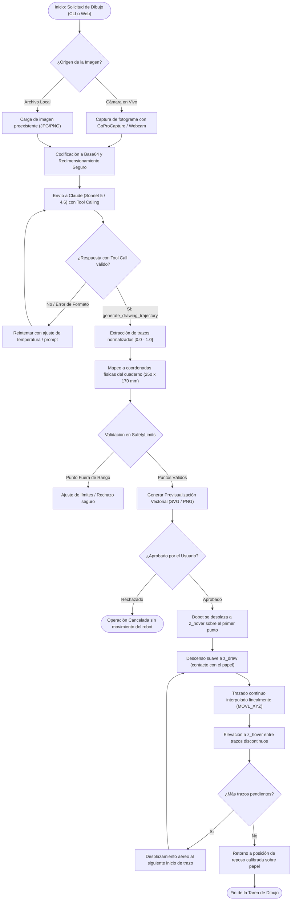
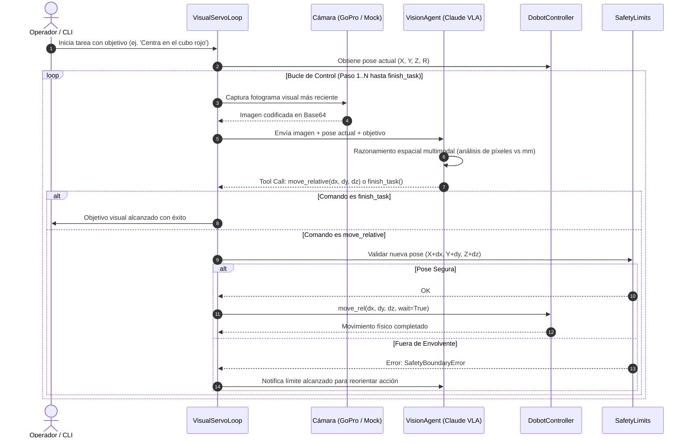

# Dobot Magician

Controlador robótico modular en Python para **Ubuntu / Linux** con soporte para cinemática cartesiana y articular, interfaces de usuario (CLI y Web Studio interactiva), visión artificial en tiempo real con cámaras **GoPro HERO por USB** y modelos multimodales **Claude (Sonnet 5 / 4.6 / 3.7)** de Anthropic para síntesis artística de bocetos y servocontrol visual (VLA).

---

## 1. Objetivos y Alcance

### 1.1 Objetivo General
Desarrollar e implementar un entorno de software robusto, modular y seguro en Python sobre Linux (Ubuntu) para operar y controlar el brazo robótico **Dobot Magician**, integrando capas de abstracción cinemática, interfaces de usuario interactivas (CLI y Web Studio), visión por computador en tiempo real y modelos fundacionales de inteligencia artificial multimodal (VLA) para la ejecución autónoma de tareas de dibujo vectorial y servocontrol visual en bucle cerrado.

### 1.2 Objetivos Específicos
1. **Control Cinemático y Efectores:** Diseñar un controlador de hardware de alto nivel ([`DobotController`](file:///home/leandropanesso/master-projects/dobot-magician/src/dobot_controller/controller.py)) con soporte para movimientos lineales (`MOVL_XYZ`) y articulares (`MOVJ_XYZ`), calibración de punto de origen (*home*), y actuación sobre efectores neumáticos (ventosa de succión, pinza/gripper) y mecánicos (soporte de marcador).
2. **Seguridad y Validación Geométrica:** Implementar un subsistema de seguridad ([`SafetyLimits`](file:///home/leandropanesso/master-projects/dobot-magician/src/dobot_controller/safety.py)) que verifique en tiempo real que cada comando cartesiano o articular se mantenga dentro del espacio de trabajo físico del robot ($R \in [160, 330]$ mm, $Z \in [-60, 160]$ mm, $R \in [-150^\circ, 150^\circ]$), previniendo daños mecánicos y colisiones contra la superficie.
3. **Visión Artificial y Conectividad GoPro:** Integrar controladores de captura de video de baja latencia ([`GoProCapture`](file:///home/leandropanesso/master-projects/dobot-magician/src/dobot_controller/vision/camera.py)) compatibles con cámaras GoPro HERO (8 a 13) a través de red USB CDC-NCM (*GoPro Connect*) y webcams V4L2/WebRTC, desacoplando la lectura de fotogramas mediante hilos dedicados para eliminar latencias de búfer.
4. **Agente Multimodal VLA (Vision-Language-Action):** Desarrollar un agente autónomo ([`VisionAgent`](file:///home/leandropanesso/master-projects/dobot-magician/src/dobot_controller/vision/agent.py)) conectado a los modelos **Anthropic Claude (Sonnet 5, Sonnet 4.6 y Claude 3.7 Sonnet)** que extraiga contornos y semántica de escenas reales, traduciéndolas en secuencias de trazos vectoriales y ajustes de posición mediante llamadas estructuradas a herramientas (*tool calling*).
5. **Estación de Trabajo Web (Web Studio):** Construir una interfaz web moderna ([`dobot_controller.web`](file:///home/leandropanesso/master-projects/dobot-magician/src/dobot_controller/web/app.py)) con FastAPI, streaming de video en directo, previsualización nativa de trayectorias en SVG, controles de jogging manual en tres ejes y persistencia del origen en disco ([`.dobot_origin.json`](file:///home/leandropanesso/master-projects/dobot-magician/.dobot_origin.json)).
6. **Simulación y Calidad de Software:** Proveer emuladores completos en memoria ([`MockDobot`](file:///home/leandropanesso/master-projects/dobot-magician/src/dobot_controller/mock.py) y [`MockCamera`](file:///home/leandropanesso/master-projects/dobot-magician/src/dobot_controller/vision/camera.py)) respaldados por una suite de 40 pruebas unitarias e integración que certifiquen el comportamiento del sistema sin depender de hardware físico.

### 1.3 Alcance y Delimitaciones
- **Sistema Operativo:** Optimizado y probado sobre distribuciones Linux (especialmente Ubuntu 20.04, 22.04 y 24.04 LTS).
- **Hardware Robótico:** Brazo robótico Dobot Magician estándar (4 grados de libertad: $X, Y, Z, R$).
- **Lienzo de Dibujo:** Proyección y escalado calibrados para cuaderno de dibujo estándar de $250 \times 170$ mm ($25 \times 17$ cm).
- **Cámaras Soportadas:** Cámaras de acción GoPro HERO 8, 9, 10, 11, 12 y 13 mediante protocolo GoPro Connect por USB, webcams locales reconocidas por V4L2 y cámaras integradas del navegador vía WebRTC.
- **Modelos de IA:** Familia Claude de Anthropic mediante la API oficial de mensajes multimodales.
- **Fuera de Alcance:** No incluye cinemática inversa analítica personalizada fuera del firmware nativo del Dobot ni control en tiempo real duro (hard real-time bajo RT-Linux).

---

## 2. Arquitectura y Componentes

El sistema está estructurado siguiendo un patrón de arquitectura en capas desacopladas, lo que permite alternar de forma transparente entre hardware físico y componentes simulados (*mocks*), garantizando extensibilidad y aislamiento entre el hardware, la lógica de control y los modelos de IA.

### 2.1 Diagrama de Arquitectura



### 2.2 Componentes Principales

| Componente | Archivo / Ubicación | Responsabilidad Principal |
| :--- | :--- | :--- |
| **`DobotController`** | [`src/dobot_controller/controller.py`](file:///home/leandropanesso/master-projects/dobot-magician/src/dobot_controller/controller.py) | Controlador central de alto nivel. Implementa context manager (`with`), cálculo de cinemática, movimientos absolutos y relativos, telemetría y actuación de efectores. |
| **`SafetyLimits`** | [`src/dobot_controller/safety.py`](file:///home/leandropanesso/master-projects/dobot-magician/src/dobot_controller/safety.py) | Validador geométrico de límites físicos. Intercepta coordenadas fuera de la envolvente cilíndrica permitida ($R \in [160, 330]$ mm, $Z \ge -60$ mm). |
| **`DrawingModule`** | [`src/dobot_controller/drawing.py`](file:///home/leandropanesso/master-projects/dobot-magician/src/dobot_controller/drawing.py) | Generador de trayectorias geométricas (círculos, arcos, rostros) y gestión estricta de cotas de contacto sobre papel (`z_draw`) y tránsito aéreo (`z_hover`). |
| **`ConnectionManager`**| [`src/dobot_controller/connection.py`](file:///home/leandropanesso/master-projects/dobot-magician/src/dobot_controller/connection.py) | Escaneo automático de puertos serie USB (`/dev/ttyUSB*`), detección de chips CP210x/CH340 y verificación de permisos del grupo `dialout`. |
| **`MockDobot`** | [`src/dobot_controller/mock.py`](file:///home/leandropanesso/master-projects/dobot-magician/src/dobot_controller/mock.py) | Simulador de hardware en memoria. Modela el estado articular, cartesiano y los actuadores neumáticos para pruebas sin conexión física. |
| **`GoProCapture` / `MockCamera`** | [`src/dobot_controller/vision/camera.py`](file:///home/leandropanesso/master-projects/dobot-magician/src/dobot_controller/vision/camera.py) | Abstracción de video multihilo de latencia cero, control de streaming MJPEG/UDP para GoPro por red USB y cámara sintética cenital con renderizado del efector. |
| **`VisionAgent`** | [`src/dobot_controller/vision/agent.py`](file:///home/leandropanesso/master-projects/dobot-magician/src/dobot_controller/vision/agent.py) | Integración con Anthropic Claude VLA. Resuelve modelos (`claude-sonnet-5`), formula prompts espaciales y procesa *tool calls* estructurados. |
| **`VisualTrajectoryDrawer`** | [`src/dobot_controller/vision/visual_drawer.py`](file:///home/leandropanesso/master-projects/dobot-magician/src/dobot_controller/vision/visual_drawer.py) | Pipeline de dibujo artístico: captura de fotograma, consulta multimodal, escalado al lienzo de $25 \times 17$ cm, previsualización gráfica y ejecución robótica continua. |
| **`VisualServoLoop`** | [`src/dobot_controller/vision/visual_servo.py`](file:///home/leandropanesso/master-projects/dobot-magician/src/dobot_controller/vision/visual_servo.py) | Bucle cerrado de percepción-acción: el robot realiza micromovimientos para que el LLM aprenda de forma empírica la matriz jacobiana visual-motora. |
| **`WebStudio`** | [`src/dobot_controller/web/`](file:///home/leandropanesso/master-projects/dobot-magician/src/dobot_controller/web/) | Aplicación FastAPI con endpoints REST, streaming de video en vivo, jogging interactivo por teclado, visor vectorial SVG y persistencia de calibración. |

---

## 3. Diagrama de Bloques / Flujo

### 3.1 Flujo del Pipeline de Dibujo Artístico Autónomo (`dobot ai-draw` y Web Studio)

El siguiente diagrama ilustra el flujo de datos y decisiones desde la adquisición óptica de una escena hasta la ejecución física de trazos continuos sobre el cuaderno de dibujo:



### 3.2 Flujo del Bucle Cerrado de Servocontrol Visual (*Visual Servoing*)

En esta modalidad de operación, el robot no utiliza trayectorias precalculadas, sino que interactúa dinámicamente con el entorno visual paso a paso:



---

## 4. Desarrollo e Implementación (Código/Configuración)

### 4.1 Requisitos del Sistema y Dependencias
- **Sistema Operativo:** Ubuntu 20.04 LTS o superior.
- **Python:** Versión 3.10, 3.11 o 3.12.
- **Herramientas de Compilación y Sistema:** `build-essential`, `python3-venv`, `libgl1`, `udev`.

Las dependencias principales se encuentran fijadas en [`requirements.txt`](file:///home/leandropanesso/master-projects/dobot-magician/requirements.txt) y gestionadas mediante empaquetado moderno en [`pyproject.toml`](file:///home/leandropanesso/master-projects/dobot-magician/pyproject.toml):
```text
anthropic>=0.40.0
pydobotplus>=1.2.0
pyserial>=3.5
opencv-python>=4.8.0.76
numpy>=1.26.0,<2.0.0
fastapi>=0.110.0
uvicorn[standard]>=0.28.0
typer[all]>=0.9.0
rich>=13.7.0
python-dotenv>=1.0.0
pytest>=8.0.0
```

### 4.2 Instalación Paso a Paso

```bash
# 1. Clonar el repositorio y navegar a la carpeta raíz
cd ~/master-projects/dobot-magician

# 2. Crear y activar el entorno virtual
python3 -m venv .venv
source .venv/bin/activate

# 3. Instalar dependencias del proyecto en modo editable
pip install --upgrade pip
pip install -r requirements.txt
pip install -e .
```

### 4.3 Configuración de Variables de Entorno (`.env`)
El proyecto requiere una clave de API de Anthropic para los módulos multimodales. Copia el archivo de ejemplo y edita tus valores:

```bash
cp .env.example .env
```

Contenido de [`.env`](file:///home/leandropanesso/master-projects/dobot-magician/.env):
```ini
# Clave oficial de Anthropic API
ANTHROPIC_API_KEY=sk-ant-api03-...

# Modelo Claude por defecto (alta fidelidad y razonamiento espacial)
ANTHROPIC_MODEL=claude-sonnet-5
```

> [!TIP]
> Puedes alternar dinámicamente entre modelos según la complejidad requerida:
> - `claude-sonnet-5`: Máxima fidelidad en trazos artísticos continuos y resolución de problemas espaciales.
> - `claude-sonnet-4-6`: Alta velocidad y excelente consistencia en *tool calling*.
> - `claude-3-7-sonnet-20250219`: Razonamiento híbrido profundo paso a paso.

### 4.4 Configuración de Permisos en Linux y Reglas udev
Para interactuar con el puerto serie `/dev/ttyUSB*` sin necesidad de ejecutar comandos como `sudo`, se incluye un script instalador automatizado ([`setup_udev.sh`](file:///home/leandropanesso/master-projects/dobot-magician/setup_udev.sh)):

```bash
# Configurar reglas udev y añadir usuario al grupo dialout
sudo ./setup_udev.sh
```

El archivo [`udev/99-dobot.rules`](file:///home/leandropanesso/master-projects/dobot-magician/udev/99-dobot.rules) define los permisos para los convertidores USB-Serial habituales (Silicon Labs CP210x y WCH CH340):
```udev
SUBSYSTEM=="tty", ATTRS{idVendor}=="10c4", ATTRS{idProduct}=="ea60", MODE="0666", GROUP="dialout"
SUBSYSTEM=="tty", ATTRS{idVendor}=="1a86", ATTRS{idProduct}=="7523", MODE="0666", GROUP="dialout"
```
*(Nota: Requiere cerrar sesión y volver a ingresar para actualizar la membresía de grupos del usuario).*

### 4.5 Configuración de Cámaras GoPro HERO por USB
1. En la GoPro, accede a **Preferencias > Conexiones > Conexión USB** y selecciona el modo **GoPro Connect** (disponible en HERO 8, 9, 10, 11, 12 y 13).
2. Conecta la cámara al computador mediante cable USB-C de alta velocidad.
3. Linux creará una interfaz de red CDC-NCM (ej. `usb0` o `enx...`).
4. Ejecuta el diagnóstico de conectividad:
   ```bash
   dobot gopro-scan
   ```

### 4.6 Uso del CLI de Terminal
El comando global `dobot` proporciona utilidades de diagnóstico, calibración y operación robótica:

```bash
# Escaneo de puertos y verificación de permisos
dobot scan

# Consultar telemetría en tiempo real (cartesiana y articular)
dobot status
dobot status --mock

# Mover a una posición absoluta segura (mm)
dobot move --x 230 --y 0 --z 40 --r 0

# Calibrador interactivo de altura Z de marcador
dobot calibrate-pen

# Trazado de figuras geométricas predefinidas
dobot draw-face --z-draw -38.5 --z-hover -25.0
dobot draw-face --air-draw --mock

# Dibujo guiado por IA a partir de la cámara en vivo
dobot ai-draw

# Bucle de servocontrol visual con objetivo en lenguaje natural
dobot ai-agent --goal "Localiza el objeto sobre la mesa y acércate"
```

### 4.7 Uso del Estudio Web Interactivo (`dobot web`)
Inicia el servidor web local con streaming de video, controles táctiles y persistencia:

```bash
# Iniciar en modo hardware real (abre http://localhost:8000 automáticamente)
dobot web

# Iniciar en modo simulación (sin robot ni cámara conectados)
dobot web --mock --port 8000
```

Características del frontend:
- **Visualizador SVG interactivo:** Renderiza la trayectoria de dibujo antes de mover el robot sobre un lienzo que reproduce el cuaderno de $25 \times 17$ cm.
- **Jogging de precisión:** Desplazamiento manual en $X, Y, Z$ con pasos de 1 mm a 50 mm o mediante flechas del teclado.
- **Persistencia de Origen:** Botón `💾 Persistir como Posición Inicial` que guarda la pose actual en [`.dobot_origin.json`](file:///home/leandropanesso/master-projects/dobot-magician/.dobot_origin.json), garantizando que las cotas $Z$ de contacto no se descalibren entre sesiones.
- **Control de Lente FOV:** Selector dinámico entre visión **Lineal** y **Gran Angular**.

### 4.8 Ejemplo de Integración en Python (API Programática)

```python
from dobot_controller import DobotController
from dobot_controller.drawing import draw_smiley_face

# Uso con gestor de contexto para liberación automática de recursos
with DobotController(mock=False) as bot:
    pose = bot.get_pose()
    print(f"Pose inicial: X={pose['x']}, Y={pose['y']}, Z={pose['z']}")

    # Movimiento seguro verificado por SafetyLimits
    bot.move_to(x=225.0, y=0.0, z=50.0, wait=True)

    # Rutina de dibujo con marcador
    draw_smiley_face(
        bot=bot,
        center_x=225.0,
        center_y=0.0,
        radius=25.0,
        z_draw=-38.5,     # Contacto calibrado con papel
        z_hover=-25.0,    # Altura de tránsito en el aire
        velocity=35.0
    )
```

---

## 5. Pruebas y Evidencias de Funcionamiento

### 5.1 Suite de Pruebas Automatizadas (Pytest)
El repositorio incorpora una batería de **40 pruebas unitarias e integración** diseñadas para verificar de forma exhaustiva cada capa del software en entornos locales y de integración continua (CI/CD):

```bash
# Ejecutar la suite completa mediante el script de aislamiento
./run_tests.sh
```

#### Resumen de Cobertura de Pruebas:

```text
============================= test session starts ==============================
platform linux -- Python 3.12.3, pytest-9.1.1, pluggy-1.6.0
rootdir: /home/leandropanesso/master-projects/dobot-magician
configfile: pytest.ini
testpaths: tests

tests/test_dobot_controller.py ..............                            [ 35%]
tests/test_vision.py ................                                    [ 75%]
tests/test_web.py ..........                                             [100%]

======================== 40 passed, 1 warning in 5.54s =========================
```

1. **Controlador y Seguridad ([`tests/test_dobot_controller.py`](file:///home/leandropanesso/master-projects/dobot-magician/tests/test_dobot_controller.py) - 14 pruebas):**
   - Validación de radio mínimo ($R < 160$ mm) y máximo ($R > 330$ mm).
   - Detección de cota $Z$ inferior al límite seguro ($Z < -60$ mm) para proteger la mesa.
   - Verificación de excepciones controladas [`SafetyBoundaryError`](file:///home/leandropanesso/master-projects/dobot-magician/src/dobot_controller/safety.py).
   - Movimientos absolutos y relativos en el emulador [`MockDobot`](file:///home/leandropanesso/master-projects/dobot-magician/src/dobot_controller/mock.py).
   - Actuación y cambio de estado de ventosa de succión y pinza.
   - Generación de puntos geométricos para dibujo de círculos y arcos.
2. **Visión Artificial e IA ([`tests/test_vision.py`](file:///home/leandropanesso/master-projects/dobot-magician/tests/test_vision.py) - 16 pruebas):**
   - Captura y dimensionamiento de fotogramas en [`MockCamera`](file:///home/leandropanesso/master-projects/dobot-magician/src/dobot_controller/vision/camera.py).
   - Codificación correcta a Base64 sin pérdidas para la API de Claude.
   - Guardado atómico de capturas en disco ([`save_snapshot`](file:///home/leandropanesso/master-projects/dobot-magician/src/dobot_controller/vision/camera.py)).
   - Conmutación de campo visual FOV (Lineal / Gran Angular).
   - Inicialización y definición de herramientas estructuradas del agente Claude.
   - Bucle de servocontrol simulado y parsing de respuestas multimodales.
3. **Servicios Web y API REST ([`tests/test_web.py`](file:///home/leandropanesso/master-projects/dobot-magician/tests/test_web.py) - 10 pruebas):**
   - Carga de la aplicación web HTML5 y disponibilidad de elementos UI.
   - Endpoints `/api/status`, `/api/move_rel` y telemetría JSON.
   - Guardado y lectura de coordenadas de origen en [`.dobot_origin.json`](file:///home/leandropanesso/master-projects/dobot-magician/.dobot_origin.json).
   - Encolado y ejecución de trazos vectoriales en segundo plano.

### 5.2 Evidencias de Operación del Agente VLA
La traza histórica persistida en [`.dobot_ai_session.json`](file:///home/leandropanesso/master-projects/dobot-magician/.dobot_ai_session.json) evidencia el razonamiento autónomo de Claude en bucle cerrado:

```json
{
  "step_counter": 6,
  "model": "claude-sonnet-5",
  "assistant_reasoning": "Bien, me he reposicionado. El efector se ha movido en la imagen y ahora está en una nueva posición. La primera diagonal sigue visible en el papel. Ahora estoy en la posición para comenzar la segunda diagonal.",
  "tool_call": {
    "name": "move_relative",
    "parameters": {
      "dx": 0.0,
      "dy": 0.0,
      "dz": -35.0,
      "reason": "Bajando el efector para hacer contacto con el papel y comenzar la segunda diagonal de la X"
    }
  }
}
```

### 5.3 Evidencias Gráficas y Vectoriales
- **Previsualización de Trazos:** El sistema genera automáticamente el archivo [`drawing_preview.png`](file:///home/leandropanesso/master-projects/dobot-magician/drawing_preview.png) antes de iniciar la ejecución sobre el papel, permitiendo al operador auditar la fidelidad geométrica.
- **Captura Óptica del Objeto:** Registro de la imagen analizada en [`captured_subject.jpg`](file:///home/leandropanesso/master-projects/dobot-magician/captured_subject.jpg) tomada directamente desde el flujo de la cámara GoPro.

---

## 6. Registro de Incidencias, Análisis y Conclusiones

### 6.1 Registro de Incidencias Técnicas y Soluciones Aplicadas

```
┌────────────────────────────────────────────────────────────────────────────────────────┐
│                        REGISTRO DE INCIDENCIAS DEL PROYECTO                            │
├────┬─────────────────────────────┬───────────────────────────┬─────────────────────────┤
│ ID │ Incidencia / Problema       │ Causa Raíz                │ Solución Implementada   │
├────┼─────────────────────────────┼───────────────────────────┼─────────────────────────┤
│ 01 │ Error Permission Denied     │ El usuario de Linux no    │ Creación de regla udev  │
│    │ al abrir /dev/ttyUSB0 sin   │ pertenecía al grupo       │ 99-dobot.rules y script │
│    │ permisos de superusuario.   │ 'dialout'.                │ setup_udev.sh.          │
├────┼─────────────────────────────┼───────────────────────────┼─────────────────────────┤
│ 02 │ Daño en puntas de marcador  │ Variaciones milimétricas  │ Comando interactivo     │
│    │ o dibujo en el aire por     │ de superficie y grosor    │ dobot calibrate-pen y   │
│    │ cotas Z imprecisas.         │ de hojas de papel.        │ archivo persistente     │
│    │                             │                           │ .dobot_origin.json.     │
├────┼─────────────────────────────┼───────────────────────────┼─────────────────────────┤
│ 03 │ Polling web sobreescribía   │ El ciclo de refresco de   │ Desacople de estados y  │
│    │ los inputs de origen en     │ /api/status sobreescribía │ guardado automático con │
│    │ edición por el usuario.     │ los inputs del formulario.│ listeners onchange.     │
├────┼─────────────────────────────┼───────────────────────────┼─────────────────────────┤
│ 04 │ Latencia severa (>3 seg)    │ Acumulación de fotogramas │ Implementación de       │
│    │ en el streaming de video    │ en el búfer interno de    │ ThreadedCameraReader    │
│    │ de la GoPro vía USB.        │ OpenCV/V4L2.              │ desacoplado en un hilo. │
├────┼─────────────────────────────┼───────────────────────────┼─────────────────────────┤
│ 05 │ Incompatibilidad de binarios│ Ruptura de ABI en C-API   │ Fijación estricta de    │
│    │ con NumPy 2.0 y OpenCV.     │ entre numpy>=2 y wheels   │ versión numpy<2.0.0 en  │
│    │                             │ precompilados de opencv.  │ requirements.txt.       │
└────┴─────────────────────────────┴───────────────────────────┴─────────────────────────┘
```

#### Análisis Detallado de Incidencias Clave:

1. **Gestión de Permisos USB Serie (Incidencia 01):**
   - *Análisis:* En distribuciones Ubuntu modernas, los dispositivos de comunicación USB se asignan por defecto al grupo `dialout` con permisos `0660`. Sin pertenencia al grupo, las llamadas a `serial.Serial()` fallaban con `PermissionError`.
   - *Solución:* Se implementó en [`connection.py`](file:///home/leandropanesso/master-projects/dobot-magician/src/dobot_controller/connection.py) la función `check_dialout_permission()`, que diagnostica el problema y ofrece la instrucción exacta de corrección, complementado con [`setup_udev.sh`](file:///home/leandropanesso/master-projects/dobot-magician/setup_udev.sh).
2. **Calibración y Desgaste del Efector de Dibujo (Incidencia 02):**
   - *Análisis:* Los marcadores poseen puntas de fieltro deformables; una presión de tan solo 1.5 mm por debajo de la cota real desgastaba la punta rápidamente, mientras que un error de +1 mm provocaba trazos discontinuos.
   - *Solución:* Se separaron estrictamente dos alturas de operación: $z_{\text{draw}}$ (cota de contacto calibrada) y $z_{\text{hover}}$ (cota de tránsito en el aire, típicamente $z_{\text{draw}} + 15$ mm), persistiendo ambas en [`.dobot_origin.json`](file:///home/leandropanesso/master-projects/dobot-magician/.dobot_origin.json) con actualización instantánea desde la interfaz web o mediante `dobot calibrate-pen`.
3. **Latencia de Fotogramas en Servocontrol Visual (Incidencia 04):**
   - *Análisis:* Al realizar servocontrol visual paso a paso, el agente tomaba decisiones basadas en fotogramas de video capturados antes del último movimiento, provocando oscilaciones e inestabilidad en el bucle cerrado.
   - *Solución:* La clase [`ThreadedCameraReader`](file:///home/leandropanesso/master-projects/dobot-magician/src/dobot_controller/vision/camera.py) mantiene un bucle en segundo plano que vacía constantemente la cola de fotogramas de la GoPro y preserva únicamente la última imagen recibida, reduciendo la latencia a menos de 40 ms.

### 6.2 Conclusiones
- **Integración Multimodal Exitosa:** La incorporación de **Claude Sonnet 5** mediante llamadas a funciones estructuradas demostró ser altamente eficaz para sintetizar trayectorias vectoriales a partir de imágenes de objetos reales, transformando un brazo robótico educativo en una estación artística automatizada.
- **Robustez y Seguridad Operativa:** El módulo de límites de seguridad ([`SafetyLimits`](file:///home/leandropanesso/master-projects/dobot-magician/src/dobot_controller/safety.py)) evitó colisiones en todas las fases de prueba, validando matemáticamente cada punto cartesiano antes de transmitirlo al firmware del robot.
- **Desarrollo Acelerado mediante Simulación:** La arquitectura con [`MockDobot`](file:///home/leandropanesso/master-projects/dobot-magician/src/dobot_controller/mock.py) y [`MockCamera`](file:///home/leandropanesso/master-projects/dobot-magician/src/dobot_controller/vision/camera.py) permitió verificar la suite completa de 40 pruebas en menos de 6 segundos y probar algoritmos complejos sin depender de la disponibilidad física del brazo robótico ni de las cámaras.
